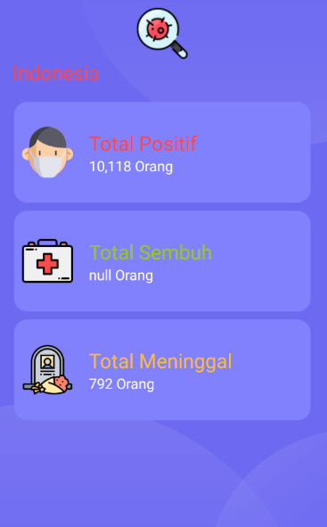

# Simple Apps for monitor covid19 in indonesia

> Made with ❤ By Irfan Zaelani.  
> 10117911  
> IF 6K

This is just a simple apps for implement local database [room](https://developer.android.com/training/data-storage/room).
And api service [retrofit](https://square.github.io/retrofit/), and implement clean architecture inspired by [mvvm-kotlin-framework](https://github.com/radhikayusuf/mvvm-kotlin-framework)
by [radhikayusuf](https://github.com/radhikayusuf/) 

### UI modify from [Android-NFC](https://github.com/Peerbits/Android-NFC)
### API from [kawalcorona](https://kawalcorona.com/)

## Screen shoots
### Splashscreen

### Homepage
